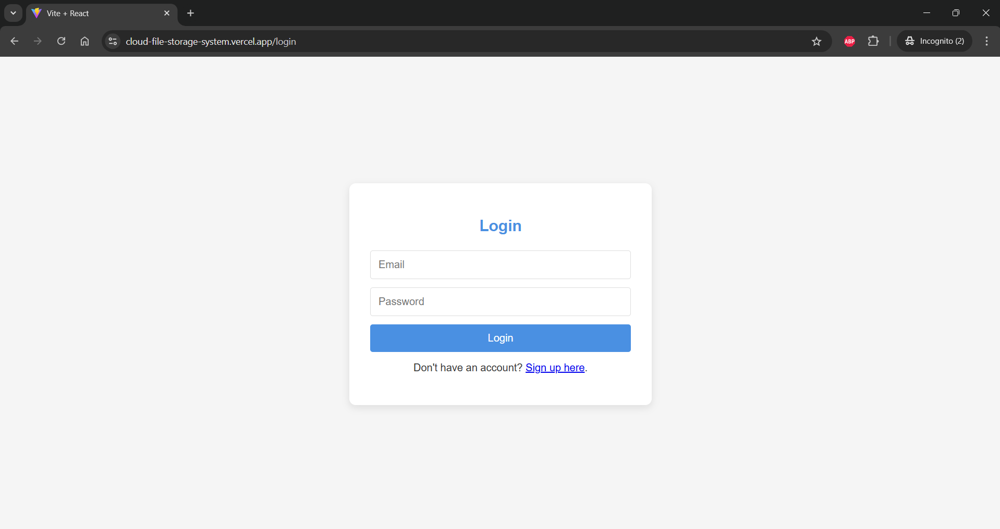
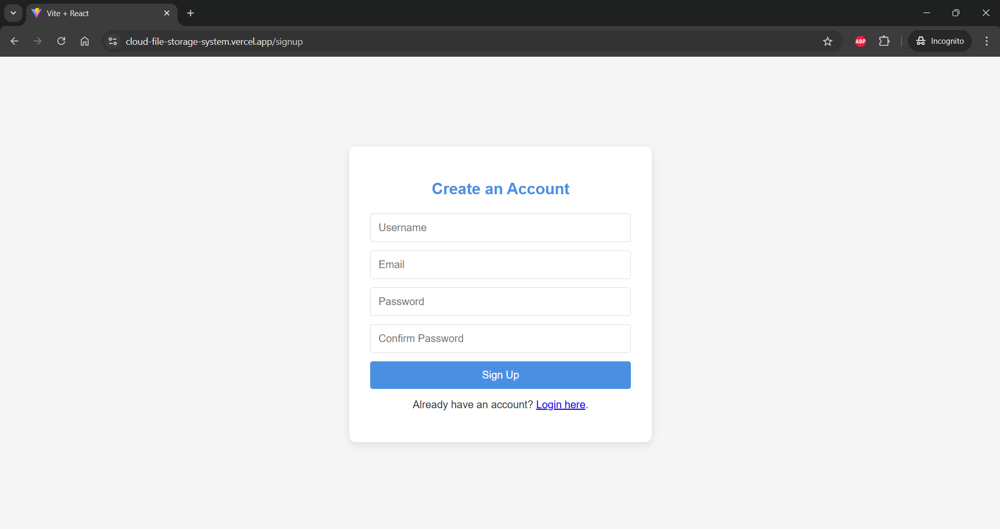
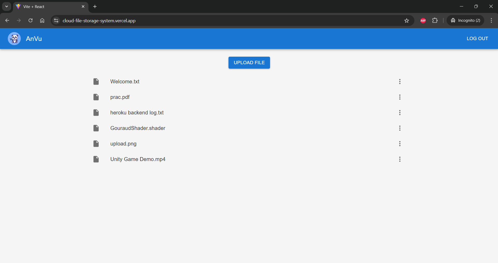
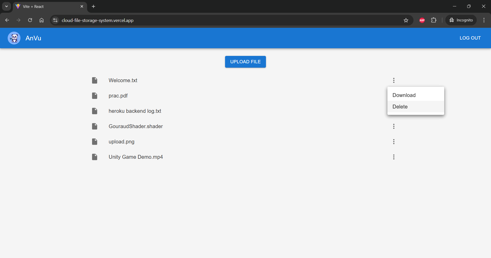

# File Storage Web Application

A full-stack file storage web application that allows users to securely upload and download files to and from the cloud. This application was built using **React** (frontend), **Express** (backend), and **Firebase Cloud Storage**.

## Live Demo

Check out the live application here: **[https://cloud-file-storage-system.vercel.app](https://cloud-file-storage-system.vercel.app)**

## Features

- **User Authentication**: Secure login and registration system using Firebase Authentication.
- **File Upload/Download**: Users can upload files directly to Firebase Cloud Storage and download them as needed.
- **File Delete**: Users can delete files directly from Firebase Cloud Storage and download them as needed.
- **File Security**: Each user only have access to their own files, they cannot access other user's files
- **Responsive UI**: Built with React for a dynamic, responsive user experience.
- **API Endpoints**: RESTful API endpoints managed by an Express server.

## Tech Stack

- **Frontend**: React, JavaScript, CSS
- **Backend**: Node.js, Express
- **Cloud Storage**: Firebase Cloud Storage
- **Authentication**: Firebase Authentication

## Project Structure

```plaintext
.
├── fs-client/                  # Frontend React app
│   ├── src/                    # React components and pages
│   └── package.json
├── fs-server/                  # Backend Express server
│   ├── src/               
│   │   ├── index.js            # API routes for file handling
│   ├── package.json
│   └── serviceAccount.json     # Firebase admin service account credentials (keep private)
├── .gitignore
└── README.md
```

## Screenshots

|               |               |
|---------------------------------------------|-----------------------------------------------|
| **Login Page**                              | **Signup Page**                               |
|             |  |
| **Upload Files**                            | **Download/Delete Files**                     |

## API Endpoints

**[API Endpoints Documentation](./fs-server/api.md)**

## Challenges and Learnings

- **Firebase Integration**: Learned how to set up Firebase Cloud Storage and handle file uploads securely.
- **Authentication**: Gained experience with Firebase Authentication for securing user access.
- **React + Express**: Strengthened full-stack skills by integrating a React frontend with an Express backend.

## Future Improvements

- **File Preview**: Add a preview for uploaded images or documents.
- **User File Management**: Implement folders or tags to help users organize files.
- **Enhanced Security**: Add additional file validation and virus scanning.

## License

This project is licensed under the MIT License.